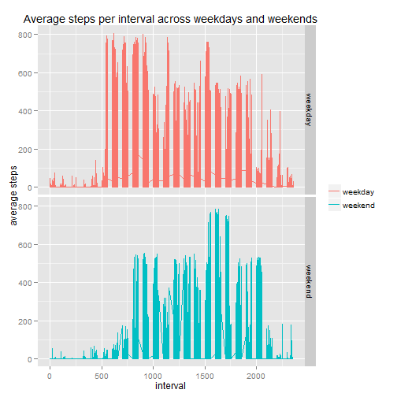

# Smartphone activity data
## Introduction
It is now possible to collect a large amount of data about personal movement using activity monitoring devices such as a Fitbit, Nike Fuelband, or Jawbone Up. These type of devices are part of the "quantified self" movement - a group of enthusiasts who take measurements about themselves regularly to improve their health, to find patterns in their behavior, or because they are tech geeks. But these data remain under-utilized both because the raw data are hard to obtain and there is a lack of statistical methods and software for processing and interpreting the data.

This assignment makes use of data from a personal activity monitoring device. This device collects data at 5 minute intervals through out the day. The data consists of two months of data from an anonymous individual collected during the months of October and November, 2012 and include the number of steps taken in 5 minute intervals each day.

## Data
Dataset: Activity monitoring data  activity.csv in this repository [52K]
The variables included in this dataset are:
- steps: Number of steps taking in a 5-minute interval (missing values are coded as NA)
- date: The date on which the measurement was taken in YYYY-MM-DD format
- interval: Identifier for the 5-minute interval in which measurement was taken
- The dataset is stored in a comma-separated-value (CSV) file and there are a total of 17,568 observations in this dataset.

## Load and pre-process data to answer a number of questions.


```r
dd <- read.table("activity.csv", sep=",",header=T, stringsAsFactors = FALSE)
library(lubridate)
dd$date <- ymd(dd$date)
```


## 2.What is the mean total number of steps taken per day?

### 2.1 Calculate the total number of steps taken per day
Use ddply from plyr package to sum steps per day and print the results


```r
library(plyr)
totalsteps<-ddply(dd,"date", numcolwise(sum), na.rm = TRUE)
        #Make a plot because that is easier to read as an overview
        plot(totalsteps$date,totalsteps$steps,type="l",lwd=1,xlab="Date",ylab="Total steps",main="Total steps per day")
```

 

### 2.2 Make a histogram of the total number of steps taken each day

```r
with(totalsteps, hist(totalsteps$steps, col= "cyan4", main = "Total steps", xlab = "Steps"))
```

 

### 2.3 Calculate and report the mean and median of the total number of steps taken per day

```r
stepsmean <- mean(totalsteps$steps, na.rm=TRUE)
stepsmedian <- median(totalsteps$steps, na.rm=TRUE)
```

For steps taken per day, the mean is 9354.2295082 and the median is 10395.

## 3.What is the average daily activity pattern?
### 3.1 Make a time series plot (i.e. type = "l") of the 5-minute interval (x-axis) and the average number of steps taken, averaged across all days (y-axis)

```r
averagesteps <- ddply(dd, c("interval"), summarise, steps = mean(steps, na.rm=TRUE))

#Make a plot because that is easier to read as an overview
plot(averagesteps$interval,averagesteps$steps,type="l",lwd=1,xlab="Interval",ylab="Average steps",main="Average steps per 5-minute interval")
```

 

### 3.2 Which 5-minute interval, on average across all the days in the dataset, contains the maximum number of steps?

```r
m <-max(averagesteps$steps)
averagesteps[averagesteps$steps==m,]
```

```
##     interval    steps
## 104      835 206.1698
```

## 4. Imputing missing values
### 4.1 Calculate and report the total number of missing values in the dataset (i.e. the total number of rows with NAs)

```r
rowsmissingvalues <- sum(is.na(dd))
```
There are 2304 rows missing values (NA).

### 4.2 Devise a strategy for filling in all of the missing values in the dataset. The strategy does not need to be sophisticated. For example, you could use the mean/median for that day, or the mean for that 5-minute interval, etc.

```r
# Decided to use mean for intervals to fill in missing values
impute.mean <- function(x) replace(x, is.na(x), mean(x, na.rm = TRUE))
```

### 4.3 Create a new dataset that is equal to the original dataset but with the missing data filled in.

```r
ddimputed <- ddply(dd, ~ interval, transform, steps = impute.mean(steps))
countna <- sum(is.na(ddimputed))
```

There are 0 NA's in the new dataset.


### 4.4 Make a histogram of the total number of steps taken each day and Calculate and report the mean and median total number of steps taken per day.

```r
#Create the dataset for the second dataset that has imputed values
totalsteps2<-ddply(ddimputed,"date", numcolwise(sum))
#Plot the data
plot(totalsteps2$date,totalsteps2$steps,type="l",lwd=1,xlab="Date",ylab="Total steps",main="Total steps per day")
```

 

```r
##Mean and median for steps per day
stepsmean2 <- mean(totalsteps2$steps, na.rm=TRUE)
stepsmedian2 <- median(totalsteps2$steps, na.rm=TRUE)
```

The mean of total steps taken per day is `rstepsmean2` and the median is 1.0766189 &times; 10<sup>4</sup>

### 4.5 Make a histogram of the total number of steps taken each day

```r
with(totalsteps2, hist(totalsteps2$steps, col= "cyan4", main = "Total steps", xlab = "Steps"))
```

 

# Do these values differ from the estimates from the first part of the assignment?

```r
par(mfrow = c(2,1))    ## 2 rows, 1 column
with(totalsteps, hist(totalsteps$steps, col= "cyan4", main = "Total steps using data with NA values", xlab = "Steps"))
with(totalsteps2, hist(totalsteps2$steps, col= "blue4", main = "Total steps using data with imputed values", xlab = "Steps"))
```

 


Yes, comparing a dataset with missing values with a dataset that has imputed values, the values differ.

# What is the impact of imputing missing data on the estimates of the total daily number of steps?

## 5. Are there differences in activity patterns between weekdays and weekends?

### 5.1 Create a new factor variable in the dataset with two levels - "weekday" and "weekend" indicating whether a given date is a weekday or weekend day.


```r
#Function to work out if it's a weekday or weekend day
dd3 <- ddimputed
dd3$wdaystring <- as.character(wday(dd3$date))
weekenddays <- c(1,7)
weekdays <- c(2,3,4,5,6)
compute.weday <- function(x) replace(x, is.element(x,weekenddays), "weekend")
compute.wkday <- function(x) replace(x, is.element(x,weekdays), "weekday")
dd3$wdaystring <- sapply(dd3$wdaystring, compute.weday)
dd3$wdaystring <- sapply(dd3$wdaystring, compute.wkday)

dd3$wdaystring <- as.factor(dd3$wdaystring)
```


### 5.2 Make a panel plot containing a time series plot (i.e. type = "l") of the 5-minute interval (x-axis) and the average number of steps taken, averaged across all weekday days or weekend days (y-axis).

```r
#Create the dataset for the plot - we are going to ignore date so don't worry about it being part of the summary.
avsteps <- aggregate(. ~ interval + date + wdaystring, data = dd3, FUN = mean)

library(ggplot2)
ggplot(avsteps, aes(x = interval, y = steps, group = wdaystring, color = wdaystring), lwd = 1.3) +
        geom_line() + facet_grid(wdaystring~.) +
        labs(x = "interval", y = "average steps", 
        title = "Average steps per interval across weekdays and weekends")
```

 

Imputing values can create a skew in the data depending on where missing values are and also, if the right method is not used the mean and medians can change.  It would be better to use a more sophisticated method for imputing missing values.
